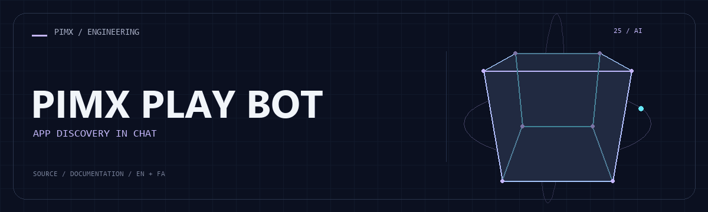

<div align="center">



**[English](README.md) · [فارسی](README.fa.md)**


</div>

# PIMX PLAY BOT

ربات Python تلگرام برای کشف برنامه با پرس‌وجوی منابع، تطبیق نتیجه، دکمه تعاملی و ارسال فایل موقت.

[GitHub](https://github.com/MOHAMMADREZAABEDINPOOR/PIMX_PLAY_BOT) · [PIMX / Profile](https://github.com/MOHAMMADREZAABEDINPOOR) · [بنر ثابت](assets/readme/hero.png)

## امکانات

- جست‌وجو و تطبیق نتیجه برنامه
- کنترل تعاملی انتخاب نتیجه در تلگرام
- HTTP ناهمگام و ابزار هر منبع
- داده محلی کاربر و پاک‌سازی فایل موقت

## پشته فنی

| ابزار | نسخه یا منبع |
|---|---|
| Python | `standard library / source imports` |

## شروع کار

Python 3 و محیط دسکتاپ برای پروژه‌های Tkinter/Turtle؛ Tkinter از اجزای نصب Python است و با pip نصب نمی‌شود. برای وابستگی‌های قدیمی از نسخه Python سازگار استفاده کنید.

```bash
git clone https://github.com/MOHAMMADREZAABEDINPOOR/PIMX_PLAY_BOT.git
cd PIMX_PLAY_BOT

python -m pip install "python-telegram-bot>=20,<23" aiohttp
python main.py
```

## تنظیمات

فایل محیط استاندارد تعریف نشده است. برای تمرین‌های مستقل تنظیم خارجی لازم نیست؛ اگر در کد ثابت‌های سرویس یا مسیر وجود دارد، آن‌ها را پیش از اجرا بررسی کنید.

## استفاده

ثابت‌های تنظیم main.py را بررسی، اعتبارنامه ربات خود را تنظیم و فایل را اجرا کنید. نام برنامه را جست‌وجو و نتیجه را انتخاب کنید.

## ساختار پروژه

| مسیر | نقش |
|---|---|
| [`assets/`](assets/) | فایل برند، رسانه و README |
| [`main.py`](main.py) | فایل ورودی یا تنظیم پروژه |
| [`users_db.json`](users_db.json) | فایل ورودی یا تنظیم پروژه |

## فرمان‌ها و بررسی

فرمان آزمون خودکار در manifest تعریف نشده است. اجرای محلی و بررسی رفتار نمونه را انجام دهید.

## استقرار

ربات را با فرایند پایدار، اسرار محیطی و فضای ذخیره خصوصی میزبانی کنید. تنها یک نمونه polling اجرا کنید. تنظیم شبکه و نسخه وابستگی را روی هاست بررسی کنید.

## محدودیت‌ها

این نسخه فایل requirements یا قفل وابستگی ندارد. منابع بیرونی ممکن است تغییر کنند و ارسال فایل به محدودیت تلگرام و منبع وابسته است. اطلاعات کاربر خصوصی بماند.

## رفع مشکل

- خطای سرویس یا ورود: اعتبارنامه و مدل و سرویس انتخابی را بررسی کنید.
- پیام تلگرام نمی‌رسد: حالت polling و وب‌هوک و نمونه همزمان را بررسی کنید.
- وابستگی غایب: از manifest استفاده یا در نبود آن importها را بررسی کنید.

## مشارکت

برای تغییر، شاخه مستقل بسازید، رفتار فعلی را بررسی کنید و توضیح روشن همراه تغییر بفرستید. اطلاعات خصوصی، خروجی build و دیتابیس محلی را commit نکنید.

## مجوز

فایل مجوز در این نسخه موجود نیست. نمایش عمومی کد به‌تنهایی مجوز استفاده مجدد نیست؛ برای شرایط استفاده با مالک مخزن هماهنگ کنید.

---

ساخته‌شده در مجموعه **PIMX** · مستندات فارسی و انگلیسی.
