<div align="center">



<a href="https://github.com/MOHAMMADREZAABEDINPOOR/PIMX_PLAY_BOT">
  
</a>

<br/>

[](https://github.com/MOHAMMADREZAABEDINPOOR)
[](https://www.gnu.org/licenses/agpl-3.0)
[](https://www.python.org/)
[](https://core.telegram.org/bots/api)
[](#persian-documentation)

<p align="center">
  <b>PIMX_PLAY_BOT</b> is an enterprise Telegram software repository and Android APK application store bot containing over 3,000 lines of robust asynchronous Python. Featuring category-based software browsing (VPN tools, network scanners, media players, utilities), direct high-speed Telegram file delivery, and automated 60-second disk cache pruning, PIMX_PLAY_BOT delivers essential software directly to users without app store restrictions.
</p>

[Project Overview](#-project-overview) •
[Directory Anatomy](#-exhaustive-directory--file-anatomy) •
[Quick Start](#-quick-start) •
[توضیحات فارسی](#persian-documentation) •
[License](#-copyleft-license--legal-attribution)

</div>

---

> [!CAUTION]
> ### 🛑 Project Status: Inactive / Archived (پروژه غیرفعال و بایگانی‌شده)
> **Notice**: This repository is currently **inactive** and maintained solely as an archived open-source APK distribution reference. The live Telegram bot is offline.
>
> **توجه مهم**: این ریپازیتوری در حال حاضر **کاملاً غیرفعال (Inactive / Archived)** می‌باشد و ربات آنلاین فعالی ندارد؛ کدهای آن به عنوان یک آرشیو کامل فنی نگهداری می‌شوند.

## ⚡ Project Overview

In environments where international app stores (Google Play, App Store) are blocked, sanctioned, or filtered, users cannot easily download critical privacy tools, proxies, or communication software.

**PIMX_PLAY_BOT** acts as a decentralized Telegram application repository:
- 📦 **Instant APK Delivery**: Sends intact Android application packages (`.apk`) directly inside the chat.
- 📁 **Structured Software Taxonomy**: Categorized into VPNs, Network Analyzers, Security Tools, and Media Utilities.
- ⏱️ **Auto-Deletion Engine**: Downloaded APK buffers are automatically erased from host disk after 60 seconds to ensure the host machine never exhausts disk space.

---

## 📂 Exhaustive Directory & File Anatomy

```
d:/code/PIMX_PLAY_BOT/
│
├── main.py                          # 3050+ lines of robust bot handlers, search logic & delivery queues
├── users_db.json                    # User account database, permissions, and broadcast recipients
├── bot.log                          # Comprehensive operational runtime log file
└── README.md                        # Master comprehensive bilingual documentation
```

---

## 🚀 Quick Start

```bash
git clone https://github.com/MOHAMMADREZAABEDINPOOR/PIMX_PLAY_BOT.git
cd PIMX_PLAY_BOT

python -m venv venv
# Windows:
.\venv\Scripts\activate
# Linux:
source venv/bin/activate

pip install python-telegram-bot httpx aiohttp
python main.py
```

---

## Persian Documentation
### 🇮🇷 مستندات فوق‌العاده مفصل، جامع و فنی به زبان فارسی

### ۱. معرفی ربات فروشگاه نرم‌افزار PIMX_PLAY_BOT
پروژه **PIMX_PLAY_BOT** یک اپ‌استور اختصاصی و فروشگاه نرم‌افزار در بستر تلگرام با بیش از ۳,۰۵۰ سطر کد پایتون است. در زمان‌هایی که دسترسی به گوگل پلی یا بازارهای برنامه‌نویسی به دلیل تحریم یا فیلترینگ مسدود می‌شود، این ربات به عنوان یک مخزن امن و مستقیم، فایل‌های نصبی معتبر اندروید (APK) فیلترشکن‌ها، ابزارهای شبکه و برنامه‌های کاربردی را مستقیماً برای کاربر ارسال می‌کند.

---

### ۲. تشریح فایل‌ها و ویژگی‌های کلیدی
- **`main.py`**: هسته نرم‌افزار شامل موتور جستجوی هوشمند فازی (Fuzzy Search)، دسته‌بندی برنامه‌ها، ارسال پیام همگانی توسط مدیر و حذف خودکار فایل‌ها پس از ۶۰ ثانیه جهت جلوگیری از پر شدن حافظه سرور.
- **`users_db.json`**: دیتابیس کاربران فعال جهت ارائه آمار دقیق و پشتیبانی از اعضای کانال PIMX_PASS.

---

## 📜 Copyleft License & Legal Attribution

Distributed under the **GNU Affero General Public License v3.0 (AGPL-3.0)**.

---

<div align="center">

<sub>Architected by <a href="https://github.com/MOHAMMADREZAABEDINPOOR"><b>MOHAMMADREZA ABEDINPOOR</b></a>. If PIMX_PLAY_BOT helps you distribute software, leave a ⭐!</sub>
</div>
